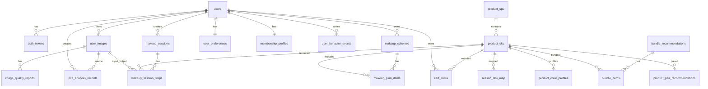

# 数据库结构总说明

数据库文件：[`backend/database/app_data.db`](backend/database/app_data.db)

建表脚本：[`backend/database/schema.sql`](backend/database/schema.sql:1)

访问层实现：[`backend/db_manager.py`](backend/db_manager.py:1)

本文档只做一件事：把当前库里每张表的**表名、字段名、约束、默认值、主外键、表功能、表间关联、级联影响、索引、触发器**全部讲清楚。

---

## 1. 数据库脚本性质

[`backend/database/schema.sql`](backend/database/schema.sql:1) 当前是：

- **全量重建脚本**
- 不是增量迁移脚本

含义：

1. 先 `DROP` 旧版表与新版表
2. 再重新 `CREATE TABLE`
3. 再创建索引、触发器
4. 最后插入初始化商品数据

所以它适合：

- 本地初始化
- 测试环境重建
- 重新清空并生成标准库结构

不适合：

- 生产环境直接覆盖已有数据
- 作为“保留老数据”的迁移脚本

---

## 2. 总体 ER 图

---

## 3. 表总览

| 表名 | 主键 | 核心功能 | 主要外键 |
|---|---|---|---|
| `users` | `user_id` | 用户主表 | - |
| `verification_codes` | `code_id` | 验证码记录 | - |
| `auth_tokens` | `token` | 登录态 | `user_id -> users` |
| `user_images` | `image_id` | 用户图片资源 | `user_id -> users` |
| `image_quality_reports` | `report_id` | 图片质量分析 | `image_id -> user_images` |
| `pca_analysis_records` | `analysis_id` | PCA 分析记录 | `user_id -> users`, `image_id -> user_images` |
| `product_spu` | `spu_id` | 商品系列主表 | - |
| `product_sku` | `sku_id` | 商品 SKU 表 | `spu_id -> product_spu` |
| `season_rules` | `season_type` | 季型规则 | - |
| `season_sku_map` | `id` | 季型到 SKU 映射 | `sku_id -> product_sku` |
| `product_color_profiles` | `id` | SKU 色彩画像 | `sku_id -> product_sku` |
| `import_jobs` | `job_id` | 导入任务记录 | - |
| `cart_items` | `cart_item_id` | 购物车 | `user_id -> users`, `sku_id -> product_sku` |
| `makeup_sessions` | `session_id` | 试妆会话 | `user_id -> users` |
| `makeup_session_steps` | `step_id` | 试妆步骤流水 | `session_id -> makeup_sessions`, `sku_id -> product_sku`, `input_image_id/output_image_id -> user_images` |
| `makeup_schemes` | `scheme_id` | 保存的妆容方案 | `user_id -> users` |
| `makeup_plan_items` | `id` | 方案明细 | `scheme_id -> makeup_schemes`, `sku_id -> product_sku` |
| `bundle_recommendations` | `bundle_id` | 套装推荐 | - |
| `bundle_items` | `id` | 套装项 | `bundle_id -> bundle_recommendations`, `sku_id -> product_sku` |
| `user_preferences` | `user_id` | 用户偏好 | `user_id -> users` |
| `user_behavior_events` | `event_id` | 行为埋点 | `user_id -> users` |
| `product_pair_recommendations` | `pair_id` | 搭配推荐关系 | `source_sku_id/target_sku_id -> product_sku` |
| `membership_profiles` | `user_id` | 会员资料 | `user_id -> users` |

---

## 4. 分表详解

## 4.1 `users`

来源：[`backend/database/schema.sql`](backend/database/schema.sql:25)

表功能：用户主表，是整个系统所有用户侧业务的根。

### 字段明细

| 字段名 | 类型 | 默认值 | 非空 | 主键 | 外键 | 检查约束 | 描述 |
|---|---|---|---|---|---|---|---|
| `user_id` | TEXT | - | 是 | 是 | - | - | 用户主键 |
| `phone` | TEXT | - | 否 | 否 | - | - | 手机号 |
| `password_hash` | TEXT | - | 否 | 否 | - | - | 密码哈希 |
| `nickname` | TEXT | - | 是 | 否 | - | `length(trim(nickname)) > 0` | 昵称 |
| `avatar` | TEXT | - | 否 | 否 | - | - | 头像地址 |
| `role` | TEXT | `user` | 是 | 否 | - | `role IN ('user','admin')` | 角色 |
| `status` | TEXT | `active` | 是 | 否 | - | `status IN ('active','disabled','deleted')` | 状态 |
| `season_type` | TEXT | - | 否 | 否 | - | - | 最近季型结果 |
| `last_login_at` | TIMESTAMP | - | 否 | 否 | - | - | 最近登录时间 |
| `created_at` | TIMESTAMP | `CURRENT_TIMESTAMP` | 否 | 否 | - | - | 创建时间 |
| `updated_at` | TIMESTAMP | `CURRENT_TIMESTAMP` | 否 | 否 | - | - | 更新时间 |

### 关联关系

- 被 [`auth_tokens`](backend/database/schema.sql:52) 引用
- 被 [`user_images`](backend/database/schema.sql:63) 引用
- 被 [`pca_analysis_records`](backend/database/schema.sql:94) 引用
- 被 [`cart_items`](backend/database/schema.sql:185) 引用
- 被 [`makeup_sessions`](backend/database/schema.sql:196) 引用
- 被 [`makeup_schemes`](backend/database/schema.sql:226) 引用
- 被 [`user_preferences`](backend/database/schema.sql:267) 引用
- 被 [`user_behavior_events`](backend/database/schema.sql:278) 引用
- 被 [`membership_profiles`](backend/database/schema.sql:301) 引用

### 索引 / 触发器

- 唯一索引：[`idx_users_phone_unique`](backend/database/schema.sql:334)
- 更新时间触发器：`trg_users_updated_at`

---

## 4.2 `verification_codes`

来源：[`backend/database/schema.sql`](backend/database/schema.sql:39)

表功能：存验证码发送、校验、使用状态。

| 字段名 | 类型 | 默认值 | 非空 | 主键 | 外键 | 检查约束 | 描述 |
|---|---|---|---|---|---|---|---|
| `code_id` | TEXT | - | 是 | 是 | - | - | 验证码记录主键 |
| `target` | TEXT | - | 是 | 否 | - | - | 手机号 |
| `code` | TEXT | - | 是 | 否 | - | - | 验证码 |
| `biz_type` | TEXT | - | 是 | 否 | - | `register/login/reset_password` | 业务类型 |
| `channel` | TEXT | `mock` | 是 | 否 | - | `mock/sms` | 渠道 |
| `status` | TEXT | `sent` | 是 | 否 | - | `sent/verified/used/expired/cancelled` | 状态 |
| `expires_at` | TIMESTAMP | - | 是 | 否 | - | - | 过期时间 |
| `verified_at` | TIMESTAMP | - | 否 | 否 | - | - | 校验时间 |
| `created_at` | TIMESTAMP | `CURRENT_TIMESTAMP` | 否 | 否 | - | - | 创建时间 |
| `meta_json` | TEXT | `{}` | 是 | 否 | - | - | 扩展字段 |

索引：[`idx_verification_codes_target_biz_status`](backend/database/schema.sql:330)

---

## 4.3 `auth_tokens`

来源：[`backend/database/schema.sql`](backend/database/schema.sql:52)

表功能：存登录态 Token。

| 字段名 | 类型 | 默认值 | 非空 | 主键 | 外键 | 检查约束 | 描述 |
|---|---|---|---|---|---|---|---|
| `token` | TEXT | - | 是 | 是 | - | - | Bearer Token |
| `user_id` | TEXT | - | 是 | 否 | `users.user_id` | - | 所属用户 |
| `token_type` | TEXT | `bearer` | 是 | 否 | - | `token_type IN ('bearer')` | Token 类型 |
| `source` | TEXT | `password` | 是 | 否 | - | `source IN ('password','code','admin')` | 登录来源 |
| `created_at` | TIMESTAMP | `CURRENT_TIMESTAMP` | 否 | 否 | - | - | 创建时间 |
| `expires_at` | TIMESTAMP | - | 否 | 否 | - | - | 过期时间 |
| `revoked_at` | TIMESTAMP | - | 否 | 否 | - | - | 吊销时间 |

级联：`user_id` 设置了 `ON DELETE CASCADE ON UPDATE CASCADE`

索引：

- [`idx_auth_tokens_user_expires`](backend/database/schema.sql:328)
- [`idx_auth_tokens_expires`](backend/database/schema.sql:329)

---

## 4.4 `user_images`

来源：[`backend/database/schema.sql`](backend/database/schema.sql:63)

表功能：统一用户图片主表，上传图、矫正图、试妆输出图、方案封面图全部在这里登记。

| 字段名 | 类型 | 默认值 | 非空 | 主键 | 外键 | 检查约束 | 描述 |
|---|---|---|---|---|---|---|---|
| `image_id` | TEXT | - | 是 | 是 | - | - | 图片主键 |
| `user_id` | TEXT | - | 是 | 否 | `users.user_id` | - | 所属用户 |
| `group_id` | TEXT | - | 否 | 否 | - | - | 同一链路分组 ID |
| `image_type` | TEXT | - | 是 | 否 | - | `upload/corrected/pca_input/pca_result/session_original/session_render/plan_cover/debug` | 图片类型 |
| `origin_filename` | TEXT | - | 否 | 否 | - | - | 原始文件名 |
| `stored_filename` | TEXT | - | 是 | 否 | - | - | 存储文件名 |
| `file_path` | TEXT | - | 是 | 否 | - | - | 相对文件路径 |
| `mime_type` | TEXT | - | 否 | 否 | - | - | MIME |
| `file_size` | INTEGER | `0` | 否 | 否 | - | - | 文件大小 |
| `width` | INTEGER | - | 否 | 否 | - | - | 宽 |
| `height` | INTEGER | - | 否 | 否 | - | - | 高 |
| `source_session_id` | TEXT | - | 否 | 否 | - | - | 来源会话 |
| `created_at` | TIMESTAMP | `CURRENT_TIMESTAMP` | 否 | 否 | - | - | 创建时间 |

关联：

- 当前表从属于 [`users`](backend/database/schema.sql:25)
- 被 [`image_quality_reports`](backend/database/schema.sql:80) 引用
- 被 [`pca_analysis_records`](backend/database/schema.sql:94) 引用
- 被 [`makeup_session_steps`](backend/database/schema.sql:210) 的输入/输出图片字段引用

索引：[`idx_user_images_user_type_created`](backend/database/schema.sql:331)

---

## 4.5 `image_quality_reports`

来源：[`backend/database/schema.sql`](backend/database/schema.sql:80)

表功能：记录图片质量分析结果。

| 字段名 | 类型 | 默认值 | 非空 | 主键 | 外键 | 检查约束 | 描述 |
|---|---|---|---|---|---|---|---|
| `report_id` | TEXT | - | 是 | 是 | - | - | 报告主键 |
| `image_id` | TEXT | - | 是 | 否 | `user_images.image_id` | - | 图片 ID |
| `has_face` | INTEGER | `0` | 是 | 否 | - | - | 是否有人脸 |
| `blur_score` | REAL | - | 否 | 否 | - | - | 模糊分数 |
| `left_eye_score` | REAL | - | 否 | 否 | - | - | 左眼分数 |
| `right_eye_score` | REAL | - | 否 | 否 | - | - | 右眼分数 |
| `mouth_score` | REAL | - | 否 | 否 | - | - | 嘴部分数 |
| `occlusion_flag` | INTEGER | `0` | 是 | 否 | - | - | 遮挡标记 |
| `raw_report_json` | TEXT | `{}` | 是 | 否 | - | - | 原始 JSON |
| `created_at` | TIMESTAMP | `CURRENT_TIMESTAMP` | 否 | 否 | - | - | 创建时间 |

级联：删除图片时自动删质量报告。

---

## 4.6 `pca_analysis_records`

来源：[`backend/database/schema.sql`](backend/database/schema.sql:94)

表功能：记录 PCA 季型分析结果。

| 字段名 | 类型 | 默认值 | 非空 | 主键 | 外键 | 检查约束 | 描述 |
|---|---|---|---|---|---|---|---|
| `analysis_id` | TEXT | - | 是 | 是 | - | - | 分析主键 |
| `user_id` | TEXT | - | 是 | 否 | `users.user_id` | - | 用户 |
| `image_id` | TEXT | - | 是 | 否 | `user_images.image_id` | - | 输入图片 |
| `season_type` | TEXT | - | 是 | 否 | - | - | 季型 |
| `tone` | TEXT | - | 否 | 否 | - | - | 冷暖调 |
| `confidence` | REAL | - | 否 | 否 | - | - | 置信度 |
| `recommended_palette_json` | TEXT | `[]` | 是 | 否 | - | - | 推荐色盘 |
| `avoid_palette_json` | TEXT | `[]` | 是 | 否 | - | - | 避免色盘 |
| `feature_vector_json` | TEXT | `[]` | 是 | 否 | - | - | 特征向量 |
| `model_version` | TEXT | - | 否 | 否 | - | - | 模型版本 |
| `created_at` | TIMESTAMP | `CURRENT_TIMESTAMP` | 否 | 否 | - | - | 创建时间 |

索引：[`idx_pca_analysis_user_created`](backend/database/schema.sql:332)

---

## 4.7 `product_spu`

来源：[`backend/database/schema.sql`](backend/database/schema.sql:110)

表功能：商品系列主表。

| 字段名 | 类型 | 默认值 | 非空 | 主键 | 外键 | 检查约束 | 描述 |
|---|---|---|---|---|---|---|---|
| `spu_id` | TEXT | - | 是 | 是 | - | - | SPU 主键 |
| `brand` | TEXT | - | 否 | 否 | - | - | 品牌 |
| `product_name` | TEXT | - | 是 | 否 | - | - | 系列名 |
| `category` | TEXT | - | 是 | 否 | - | `base/brow/eye/contour/lip` | 品类 |
| `apply_area` | TEXT | - | 是 | 否 | - | `skin/brow/eyes/lips/cheeks` | 上妆区域 |
| `image_url` | TEXT | - | 否 | 否 | - | - | 商品图 |
| `status` | TEXT | `active` | 是 | 否 | - | `active/inactive` | 状态 |
| `created_at` | TIMESTAMP | `CURRENT_TIMESTAMP` | 否 | 否 | - | - | 创建时间 |

说明：

- `category` 是业务分类
- `apply_area` 是渲染区域语义
- 当前眼妆商品已明确使用 `eyes`

索引：[`idx_product_spu_category`](backend/database/schema.sql:309)

---

## 4.8 `product_sku`

来源：[`backend/database/schema.sql`](backend/database/schema.sql:121)

表功能：商品 SKU 明细，是试妆、推荐、购物车真正使用的商品实体。

| 字段名 | 类型 | 默认值 | 非空 | 主键 | 外键 | 检查约束 | 描述 |
|---|---|---|---|---|---|---|---|
| `sku_id` | TEXT | - | 是 | 是 | - | - | SKU 主键 |
| `spu_id` | TEXT | - | 是 | 否 | `product_spu.spu_id` | - | 所属 SPU |
| `shade_name` | TEXT | - | 否 | 否 | - | - | 色号名 |
| `hex_color` | TEXT | - | 是 | 否 | - | - | 原始色值 |
| `render_hex` | TEXT | - | 是 | 否 | - | - | 渲染色值 |
| `render_mode` | INTEGER | `0` | 否 | 否 | - | `0/1` | 渲染模式 |
| `finish_type` | TEXT | - | 否 | 否 | - | - | 妆效类型 |
| `opacity` | REAL | `0.6` | 否 | 否 | - | `0<=x<=1` | 透明度 |
| `feather` | INTEGER | `8` | 否 | 否 | - | `0<=x<=100` | 羽化 |
| `transparency_max` | REAL | `0.7` | 否 | 否 | - | `0<=x<=1` | 最大透明度 |
| `season_match` | TEXT | - | 否 | 否 | - | - | 匹配季型 |
| `price` | REAL | `0` | 否 | 否 | - | `price>=0` | 价格 |
| `stock` | INTEGER | `0` | 否 | 否 | - | `stock>=0` | 库存 |
| `source` | TEXT | `seed` | 否 | 否 | - | - | 来源 |
| `mask_params` | TEXT | - | 否 | 否 | - | - | 蒙版参数 JSON |
| `render_params` | TEXT | - | 否 | 否 | - | - | 渲染参数 JSON |
| `created_at` | TIMESTAMP | `CURRENT_TIMESTAMP` | 否 | 否 | - | - | 创建时间 |

索引：

- [`idx_product_sku_spu_id`](backend/database/schema.sql:310)
- [`idx_product_sku_season_match`](backend/database/schema.sql:311)

被这些表引用：

- [`season_sku_map`](backend/database/schema.sql:154)
- [`product_color_profiles`](backend/database/schema.sql:163)
- [`cart_items`](backend/database/schema.sql:185)
- [`makeup_session_steps`](backend/database/schema.sql:210)
- [`makeup_plan_items`](backend/database/schema.sql:239)
- [`bundle_items`](backend/database/schema.sql:258)
- [`product_pair_recommendations`](backend/database/schema.sql:290)

---

## 4.9 `season_rules`

来源：[`backend/database/schema.sql`](backend/database/schema.sql:142)

表功能：保存季型规则色盘。

| 字段名 | 类型 | 默认值 | 非空 | 主键 | 外键 | 检查约束 | 描述 |
|---|---|---|---|---|---|---|---|
| `season_type` | TEXT | - | 是 | 是 | - | - | 季型主键 |
| `tone` | TEXT | - | 否 | 否 | - | - | 冷暖调 |
| `lips_palette` | TEXT | `[]` | 是 | 否 | - | - | 唇部推荐色盘 |
| `cheeks_palette` | TEXT | `[]` | 是 | 否 | - | - | 面部推荐色盘 |
| `brow_palette` | TEXT | `[]` | 是 | 否 | - | - | 眉部推荐色盘 |
| `avoid_palette` | TEXT | `[]` | 是 | 否 | - | - | 避免色盘 |
| `recommended_palette` | TEXT | `[]` | 是 | 否 | - | - | 综合推荐色盘 |
| `source` | TEXT | `excel` | 否 | 否 | - | - | 来源 |
| `updated_at` | TIMESTAMP | `CURRENT_TIMESTAMP` | 否 | 否 | - | - | 更新时间 |

---

## 4.10 `season_sku_map`

来源：[`backend/database/schema.sql`](backend/database/schema.sql:154)

表功能：季型与 SKU 的推荐映射表。

| 字段名 | 类型 | 默认值 | 非空 | 主键 | 外键 | 检查约束 | 描述 |
|---|---|---|---|---|---|---|---|
| `id` | INTEGER | 自增 | 是 | 是 | - | - | 自增主键 |
| `season_type` | TEXT | - | 是 | 否 | - | - | 季型 |
| `sku_id` | TEXT | - | 是 | 否 | `product_sku.sku_id` | - | SKU |
| `source` | TEXT | `excel` | 否 | 否 | - | - | 来源 |
| `created_at` | TIMESTAMP | `CURRENT_TIMESTAMP` | 否 | 否 | - | - | 创建时间 |

索引：

- 普通索引：[`idx_season_sku_map_season_sku`](backend/database/schema.sql:314)
- 唯一索引：`idx_season_sku_map_unique`

---

## 4.11 `product_color_profiles`

来源：[`backend/database/schema.sql`](backend/database/schema.sql:163)

表功能：描述某个 SKU 的色彩角色与画像。

| 字段名 | 类型 | 默认值 | 非空 | 主键 | 外键 | 检查约束 | 描述 |
|---|---|---|---|---|---|---|---|
| `id` | INTEGER | 自增 | 是 | 是 | - | - | 自增主键 |
| `sku_id` | TEXT | - | 是 | 否 | `product_sku.sku_id` | - | 关联 SKU |
| `shade_name` | TEXT | - | 否 | 否 | - | - | 色号名 |
| `hex_color` | TEXT | - | 是 | 否 | - | - | 色值 |
| `color_role` | TEXT | `primary` | 是 | 否 | - | `primary/palette/render/avoid` | 色彩角色 |
| `source` | TEXT | `excel` | 否 | 否 | - | - | 来源 |
| `created_at` | TIMESTAMP | `CURRENT_TIMESTAMP` | 否 | 否 | - | - | 创建时间 |

索引：

- [`idx_product_color_profiles_sku_id`](backend/database/schema.sql:312)
- [`idx_product_color_profiles_hex_color`](backend/database.schema.sql:313)

---

## 4.12 `import_jobs`

来源：[`backend/database/schema.sql`](backend/database/schema.sql:174)

表功能：记录导入任务的来源、状态与摘要。

| 字段名 | 类型 | 默认值 | 非空 | 主键 | 外键 | 检查约束 | 描述 |
|---|---|---|---|---|---|---|---|
| `job_id` | TEXT | - | 是 | 是 | - | - | 任务主键 |
| `source_name` | TEXT | - | 是 | 否 | - | - | 数据源名称 |
| `source_path` | TEXT | - | 否 | 否 | - | - | 文件路径 |
| `status` | TEXT | `pending` | 是 | 否 | - | `pending/running/success/failed` | 状态 |
| `summary_json` | TEXT | `{}` | 是 | 否 | - | - | 摘要 |
| `error_message` | TEXT | - | 否 | 否 | - | - | 错误信息 |
| `created_at` | TIMESTAMP | `CURRENT_TIMESTAMP` | 否 | 否 | - | - | 创建时间 |
| `finished_at` | TIMESTAMP | - | 否 | 否 | - | - | 结束时间 |

---

## 4.13 `cart_items`

来源：[`backend/database/schema.sql`](backend/database/schema.sql:185)

表功能：购物车明细表。

| 字段名 | 类型 | 默认值 | 非空 | 主键 | 外键 | 检查约束 | 描述 |
|---|---|---|---|---|---|---|---|
| `cart_item_id` | TEXT | - | 是 | 是 | - | - | 购物车项主键 |
| `user_id` | TEXT | - | 是 | 否 | `users.user_id` | - | 用户 |
| `sku_id` | TEXT | - | 是 | 否 | `product_sku.sku_id` | - | SKU |
| `quantity` | INTEGER | `1` | 是 | 否 | - | `quantity > 0` | 数量 |
| `created_at` | TIMESTAMP | `CURRENT_TIMESTAMP` | 否 | 否 | - | - | 创建时间 |
| `updated_at` | TIMESTAMP | `CURRENT_TIMESTAMP` | 否 | 否 | - | - | 更新时间 |

索引：

- 唯一索引：[`idx_cart_items_user_sku_unique`](backend/database/schema.sql:316)
- 普通索引：[`idx_cart_items_user_id`](backend/database/schema.sql:317)

触发器：`trg_cart_items_updated_at`

---

## 4.14 `makeup_sessions`

来源：[`backend/database/schema.sql`](backend/database/schema.sql:196)

表功能：一条试妆流程的会话主表。

| 字段名 | 类型 | 默认值 | 非空 | 主键 | 外键 | 检查约束 | 描述 |
|---|---|---|---|---|---|---|---|
| `session_id` | TEXT | - | 是 | 是 | - | - | 会话主键 |
| `user_id` | TEXT | - | 是 | 否 | `users.user_id` | - | 用户 |
| `original_image` | TEXT | - | 是 | 否 | - | - | 原始图 URL |
| `current_image` | TEXT | - | 是 | 否 | - | - | 当前结果图 URL |
| `applied_products` | TEXT | `[]` | 是 | 否 | - | - | 已应用商品 JSON |
| `render_history` | TEXT | `[]` | 是 | 否 | - | - | 渲染历史 JSON |
| `step` | INTEGER | `0` | 是 | 否 | - | `step >= 0` | 当前步骤 |
| `status` | TEXT | `active` | 是 | 否 | - | `active/closed` | 状态 |
| `created_at` | TIMESTAMP | `CURRENT_TIMESTAMP` | 否 | 否 | - | - | 创建时间 |
| `updated_at` | TIMESTAMP | `CURRENT_TIMESTAMP` | 否 | 否 | - | - | 更新时间 |

索引：

- [`idx_makeup_sessions_user_id`](backend/database/schema.sql:319)
- [`idx_makeup_sessions_user_status_updated`](backend/database/schema.sql:320)

触发器：`trg_makeup_sessions_updated_at`

---

## 4.15 `makeup_session_steps`

来源：[`backend/database/schema.sql`](backend/database/schema.sql:210)

表功能：试妆步骤流水表，记录每次局部/整体渲染的输入与输出图片。

| 字段名 | 类型 | 默认值 | 非空 | 主键 | 外键 | 检查约束 | 描述 |
|---|---|---|---|---|---|---|---|
| `step_id` | TEXT | - | 是 | 是 | - | - | 步骤主键 |
| `session_id` | TEXT | - | 是 | 否 | `makeup_sessions.session_id` | - | 所属会话 |
| `step_no` | INTEGER | - | 是 | 否 | - | - | 步骤序号 |
| `category` | TEXT | - | 是 | 否 | - | - | 分类 |
| `sku_id` | TEXT | - | 否 | 否 | `product_sku.sku_id` | - | SKU |
| `input_image_id` | TEXT | - | 否 | 否 | `user_images.image_id` | - | 输入图 |
| `output_image_id` | TEXT | - | 否 | 否 | `user_images.image_id` | - | 输出图 |
| `render_params_json` | TEXT | `{}` | 是 | 否 | - | - | 渲染参数 |
| `created_at` | TIMESTAMP | `CURRENT_TIMESTAMP` | 否 | 否 | - | - | 创建时间 |

级联：

- 删除会话：级联删除步骤
- 删除图片：输入/输出图外键设为 `SET NULL`

索引：[`idx_makeup_session_steps_session_no`](backend/database/schema.sql:321)

---

## 4.16 `makeup_schemes`

来源：[`backend/database/schema.sql`](backend/database/schema.sql:226)

表功能：用户保存的妆容方案主表。

| 字段名 | 类型 | 默认值 | 非空 | 主键 | 外键 | 检查约束 | 描述 |
|---|---|---|---|---|---|---|---|
| `scheme_id` | TEXT | - | 是 | 是 | - | - | 方案主键 |
| `user_id` | TEXT | - | 是 | 否 | `users.user_id` | - | 用户 |
| `scheme_name` | TEXT | - | 是 | 否 | - | - | 方案名称 |
| `product_list` | TEXT | - | 是 | 否 | - | - | 商品 JSON 列表 |
| `cover_image` | TEXT | - | 否 | 否 | - | - | 封面图 URL |
| `season_type` | TEXT | - | 否 | 否 | - | - | 季型 |
| `scene_tag` | TEXT | - | 否 | 否 | - | - | 场景标签 |
| `recommend_reason` | TEXT | - | 否 | 否 | - | - | 推荐理由 |
| `created_at` | TIMESTAMP | `CURRENT_TIMESTAMP` | 否 | 否 | - | - | 创建时间 |

索引：

- [`idx_makeup_schemes_user_id`](backend/database/schema.sql:322)
- [`idx_makeup_schemes_user_created`](backend/database.schema.sql:323)

---

## 4.17 `makeup_plan_items`

来源：[`backend/database/schema.sql`](backend/database/schema.sql:239)

表功能：方案结构化明细表。

| 字段名 | 类型 | 默认值 | 非空 | 主键 | 外键 | 检查约束 | 描述 |
|---|---|---|---|---|---|---|---|
| `id` | INTEGER | 自增 | 是 | 是 | - | - | 自增主键 |
| `scheme_id` | TEXT | - | 是 | 否 | `makeup_schemes.scheme_id` | - | 所属方案 |
| `category` | TEXT | - | 是 | 否 | - | - | 分类 |
| `sku_id` | TEXT | - | 是 | 否 | `product_sku.sku_id` | - | SKU |
| `sort_order` | INTEGER | `0` | 是 | 否 | - | - | 排序 |
| `created_at` | TIMESTAMP | `CURRENT_TIMESTAMP` | 否 | 否 | - | - | 创建时间 |

索引：[`idx_makeup_plan_items_scheme`](backend/database/schema.sql:324)

---

## 4.18 `bundle_recommendations`

来源：[`backend/database/schema.sql`](backend/database/schema.sql:250)

表功能：套装推荐主表。

| 字段名 | 类型 | 默认值 | 非空 | 主键 | 外键 | 检查约束 | 描述 |
|---|---|---|---|---|---|---|---|
| `bundle_id` | TEXT | - | 是 | 是 | - | - | 套装主键 |
| `season_type` | TEXT | - | 是 | 否 | - | - | 适用季型 |
| `bundle_name` | TEXT | - | 是 | 否 | - | - | 套装名称 |
| `description` | TEXT | - | 否 | 否 | - | - | 描述 |
| `created_at` | TIMESTAMP | `CURRENT_TIMESTAMP` | 否 | 否 | - | - | 创建时间 |

---

## 4.19 `bundle_items`

来源：[`backend/database/schema.sql`](backend/database/schema.sql:258)

表功能：套装包含的 SKU 明细。

| 字段名 | 类型 | 默认值 | 非空 | 主键 | 外键 | 检查约束 | 描述 |
|---|---|---|---|---|---|---|---|
| `id` | INTEGER | 自增 | 是 | 是 | - | - | 自增主键 |
| `bundle_id` | TEXT | - | 是 | 否 | `bundle_recommendations.bundle_id` | - | 套装 ID |
| `sku_id` | TEXT | - | 是 | 否 | `product_sku.sku_id` | - | 商品 SKU |
| `sort_order` | INTEGER | `0` | 是 | 否 | - | - | 排序 |

---

## 4.20 `user_preferences`

来源：[`backend/database/schema.sql`](backend/database/schema.sql:267)

表功能：用户偏好设置。

| 字段名 | 类型 | 默认值 | 非空 | 主键 | 外键 | 检查约束 | 描述 |
|---|---|---|---|---|---|---|---|
| `user_id` | TEXT | - | 是 | 是 | `users.user_id` | - | 用户主键，同时也是外键 |
| `preferred_scenes_json` | TEXT | `[]` | 是 | 否 | - | - | 场景偏好 |
| `preferred_categories_json` | TEXT | `[]` | 是 | 否 | - | - | 分类偏好 |
| `preferred_finishes_json` | TEXT | `[]` | 是 | 否 | - | - | 妆效偏好 |
| `budget_min` | REAL | `0` | 否 | 否 | - | - | 最低预算 |
| `budget_max` | REAL | `0` | 否 | 否 | - | - | 最高预算 |
| `updated_at` | TIMESTAMP | `CURRENT_TIMESTAMP` | 否 | 否 | - | - | 更新时间 |

触发器：`trg_user_preferences_updated_at`

---

## 4.21 `user_behavior_events`

来源：[`backend/database/schema.sql`](backend/database/schema.sql:278)

表功能：记录用户行为埋点，如浏览、点击、收藏、推荐反馈等。

| 字段名 | 类型 | 默认值 | 非空 | 主键 | 外键 | 检查约束 | 描述 |
|---|---|---|---|---|---|---|---|
| `event_id` | TEXT | - | 是 | 是 | - | - | 事件主键 |
| `user_id` | TEXT | - | 是 | 否 | `users.user_id` | - | 用户 |
| `event_type` | TEXT | - | 是 | 否 | - | - | 事件类型 |
| `ref_type` | TEXT | - | 是 | 否 | - | - | 关联对象类型 |
| `ref_id` | TEXT | - | 否 | 否 | - | - | 关联对象 ID |
| `event_value` | REAL | `1` | 否 | 否 | - | - | 权重值 |
| `payload_json` | TEXT | `{}` | 是 | 否 | - | - | 事件补充信息 |
| `created_at` | TIMESTAMP | `CURRENT_TIMESTAMP` | 否 | 否 | - | - | 创建时间 |

索引：[`idx_user_behavior_user_type_created`](backend/database/schema.sql:325)

---

## 4.22 `product_pair_recommendations`

来源：[`backend/database/schema.sql`](backend/database.schema.sql:290)

表功能：描述两个 SKU 的搭配推荐关系。

| 字段名 | 类型 | 默认值 | 非空 | 主键 | 外键 | 检查约束 | 描述 |
|---|---|---|---|---|---|---|---|
| `pair_id` | TEXT | - | 是 | 是 | - | - | pair 主键 |
| `source_sku_id` | TEXT | - | 是 | 否 | `product_sku.sku_id` | - | 源 SKU |
| `target_sku_id` | TEXT | - | 是 | 否 | `product_sku.sku_id` | - | 目标 SKU |
| `reason` | TEXT | - | 否 | 否 | - | - | 推荐原因 |
| `score` | REAL | `0` | 否 | 否 | - | - | 分数 |
| `created_at` | TIMESTAMP | `CURRENT_TIMESTAMP` | 否 | 否 | - | - | 创建时间 |

索引：

- [`idx_product_pair_source_score`](backend/database.schema.sql:326)
- 唯一索引：`idx_product_pair_unique`

---

## 4.23 `membership_profiles`

来源：[`backend/database/schema.sql`](backend/database/schema.sql:301)

表功能：用户会员等级、积分资料。

| 字段名 | 类型 | 默认值 | 非空 | 主键 | 外键 | 检查约束 | 描述 |
|---|---|---|---|---|---|---|---|
| `user_id` | TEXT | - | 是 | 是 | `users.user_id` | - | 用户主键，同时外键 |
| `member_level` | TEXT | `basic` | 是 | 否 | - | - | 会员等级 |
| `points` | INTEGER | `0` | 是 | 否 | - | - | 积分 |
| `updated_at` | TIMESTAMP | `CURRENT_TIMESTAMP` | 否 | 否 | - | - | 更新时间 |

触发器：`trg_membership_profiles_updated_at`

---

## 5. 索引总览

关键索引：

- 用户手机号唯一：[`idx_users_phone_unique`](backend/database/schema.sql:334)
- 购物车用户+SKU 唯一：[`idx_cart_items_user_sku_unique`](backend/database/schema.sql:316)
- 试妆会话按用户/状态/时间：[`idx_makeup_sessions_user_status_updated`](backend/database.schema.sql:320)
- 用户图片按用户/类型/时间：[`idx_user_images_user_type_created`](backend/database.schema.sql:331)
- 季型映射唯一：`idx_season_sku_map_unique`
- 商品搭配唯一：`idx_product_pair_unique`

---

## 6. 触发器总览

当前脚本定义了这些 `updated_at` 触发器：

- `trg_users_updated_at`
- `trg_cart_items_updated_at`
- `trg_makeup_sessions_updated_at`
- `trg_user_preferences_updated_at`
- `trg_membership_profiles_updated_at`

作用：

- SQLite 默认不会在 `UPDATE` 时自动刷新 `updated_at`
- 这些触发器负责在更新时自动改写时间

---

## 7. 图片存储策略建议

### 7.1 直接进入正式目录的资源

- `upload`
- `avatar`

原因：

- 用户主动提交
- 个人中心需要稳定回显
- 不应被试妆临时清理误删

### 7.2 先进入临时目录、保存方案时迁移的资源

- `session_original`
- `session_render`
- `plan_cover`
- 可选地包括部分 `corrected`

### 7.3 推荐策略

如果产品要求个人中心长期回看：

- 原始上传图 `upload`：正式保存
- 成功分析后的 `corrected`：建议正式保存
- 会话渲染图 `session_render`：临时保存，用户保存方案后迁移

---

## 8. 当前数据库脚本已修正的问题

本轮已修正：

1. 新版表补了 `DROP TABLE IF EXISTS`
2. 新版索引补了 `DROP INDEX IF EXISTS`
3. 新版触发器补了 `DROP TRIGGER IF EXISTS`
4. `apply_area` 增加 `eyes`
5. 眼妆种子数据从 `skin` 改为 `eyes`
6. `season_sku_map` 增加唯一约束
7. `product_pair_recommendations` 增加唯一约束
8. 多张核心表增加级联删除 / 更新规则
9. 补了 `updated_at` 触发器

---

## 9. 仍需注意的设计点

1. `season_type` 在多张表里仍主要是自由文本，没有全部外键化
2. `makeup_sessions.original_image/current_image` 仍是 URL 字符串，不是 `user_images` 外键
3. `makeup_schemes.product_list` 与 `makeup_plan_items` 是双存储，要由应用层保证一致
4. 删除数据库记录时，应用层仍需同步删除物理文件

---

## 10. 参考文件

- 建表脚本：[`backend/database/schema.sql`](backend/database/schema.sql:1)
- 数据访问层：[`backend/db_manager.py`](backend/db_manager.py:1)
- 用户接口：[`backend/fastapi_app.py`](backend/fastapi_app.py:1510)
- 试妆接口：[`backend/fastapi_app.py`](backend/fastapi_app.py:1781)
- 购物车接口：[`backend/fastapi_app.py`](backend/fastapi_app.py:2227)

